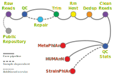

# 

## Shotgun Metagenomics (Marker-Based)
MetaPhlAn, HUMAnN, and StrainPhlAn form a complementary suite for shotgun metagenomic profiling. MetaPhlAn identifies and quantifies microbial taxa directly from sequencing reads using unique clade-specific marker genes. HUMAnN builds on those results to profile functional potential—linking reads to metabolic pathways and gene families. StrainPhlAn refines the taxonomic picture further by reconstructing strain-level variation within species, enabling comparison across samples or subjects. Together, these methods deliver species- to strain-level insights in two-to-three weeks, ready for downstream statistical analysis.

---
<p align="left">
  
</p>
<p><strong>Sequencing Reads</strong></p>


<p><strong>Data QC</strong></p>


<p><strong>Analysis</strong></p>


<p><strong>Additional Service(s)</strong></p>


---
## Deliverables

All output files are generated automatically and provided in organized directories:
<details><summary><span style="color:#3b82f6; font-weight:600;">Output Directory Structure</span></summary>

```text
project/
├── envs/
├── results/
|  ├── metaphlan
|  ├── humann
|  ├── strainphlan
|    ├── clade 1
|    ├── clade 2
|    ├── clade k
├── scripts/
└── METHODS.txt
```
</details>
<br>

| Output File | Description | Format |
|--------------|-------------|---------|
| `merged_metaphlan4_profile.tsv` | Species-level relative abundances across samples | TSV |
| `humann_genefamilies.tsv` | Gene family abundance table | TSV |
| `humann_pathabundance.tsv` | Metabolic pathway abundance table | TSV |
| `humann_pathcoverage.tsv` | Pathway coverage table | TSV |
| `RAxML_bestTree.StrainPhlAn4.tre` | Phylogenetic tree of strain-level marker alignments | Newick |
| `StrainPhlAn4_concatenated.aln` | Multiple sequence alignment of marker genes | FASTA |
| `multiqc_report.html` | Aggregated QC summary | HTML |

All files are delivered via secure download (Dropbox).  

> <span style="color:#dc2626; font-weight:700;">⚠️ Warning:</span>  
> This service provides **data processing and output generation only**.  
> No biological or statistical interpretation is included in the standard deliverable.  
> Optional add-ons such as result interpretation, figure preparation, or data upload to public repositories (e.g. NCBI SRA, ENA) are available on request.

---
## Input Requirements

| Requirement | Specification |
|--------------|----------------|
| Input format | Paired- or single-end FASTQ (gzipped) |
| Recommended read length | 100–150 bp |
| Minimum read depth | ≥ 3 million reads per sample |
| Accepted platforms | Illumina (NovaSeq, NextSeq, HiSeq) |
| Optional preprocessing | Repair (BBTools) or host removal (BBSplit/Kraken2) |

Input files should be clearly named using sample identifiers (`sampleID_R1.fastq.gz`, `sampleID_R2.fastq.gz`).  
Invalid or corrupt FASTQs will halt processing and trigger a report notification.

> <span style="color:#2563eb; font-weight:600;">💡 Note:</span>  
> To generate an accurate quotation and allocate sufficient storage, please specify the **number of samples** and the **approximate size of each FASTQ file**.  
> This information is required to estimate total disk usage and compute resources prior to analysis.

---
## QC & Processing

1. **Initial QC** – Read quality evaluated using *FastQC* and summarised with *MultiQC*.  
2. **Trimming** – Adapters and low-quality bases removed using *fastp*.  
3. **Optional Repair** – Read pairing validated with *BBTools repair* (if required).  
    - File integrity validation: *MD5 checksum*
    - Read count comparison between R1 and R2: *seqtk stats*
    - Sample identity checks: *mash sketch*
    - Multi-lane concatenation: *cat*
4. **Host Read Removal** – *Kraken2* used to remove contaminant or host reads when a host genome is supplied.  
5. **Deduplication** – *Clumpify* reduces optical duplicates to improve downstream mapping.  
6. **QC Reporting** – Comprehensive MultiQC summary provided.
7. **Profiling** –  
    - *MetaPhlAn4* for species-level taxonomic profiling  
    - *HUMAnN3* for gene- and pathway-level functional profiling  
    - *StrainPhlAn4* for within-species phylogenetic reconstruction (depth permitting)

---
## Data Handling & Reproducibility

- **Dropbox** is used as it is OS-independent and user-friendly.
- Data sharing via Dropbox may involve temporary storage on servers located **outside the European Economic Area (EEA)**.
- **Secure File Transfer (SFTP)** is available as an alternative delivery method for clients who cannot use Dropbox.
-  Access is restricted to whitelisted IP addresses, and temporary credentials are issued per project.
-  Clients can connect using standard SFTP clients such as **FileZilla** or **WinSCP**.
- All FASTQ processing is executed within a locked **Conda environment** (`env.yml`) ensuring version control.
- Data are processed in EU-based cloud environments (CloudCIX; https://www.cloudcix.com/) with GDPR-compliant storage.

> <span style="color:#dc2626; font-weight:700;">⚠️ Warning:</span>  
> FASTQ data is retained for a maximum **30-days post-delivery** after project completion and then purged from all active storage.

---
## Technical Details

| Component | Tool / Version | Notes |
|------------|----------------|-------|
| QC | FastQC v0.12, MultiQC v1.15 | Read quality summaries |
| Trimming | fastp v0.23 | Adapter and low-quality trimming |
| Host removal | BBTools / Kraken2 | Optional; host genome or taxonomy database required |
| Deduplication | Clumpify v39 | Duplicate read removal |
| Taxonomic profiling | MetaPhlAn v4.x | Marker gene-based species profiling |
| Functional profiling | HUMAnN v3.x | Gene family and pathway quantification |
| Strain-level profiling | StrainPhlAn v4.x | Intra-species phylogenetic reconstruction |
| Reporting | MultiQC v1.15 | Combined QC report |

All runs use >8 vCPU with 60 GB RAM allocation per sample.

---
## Turnaround & Pricing

| Metric | Typical | Notes |
|--------|----------|-------|
| Turnaround time | 10–15 working days | Queue dependent |
| Sample volume | 1 to >100 samples | Scalable |
| Admin fee | €400 | Initial project and data transfer setup |
| Pricing | €60 | Per sample price for marker-based shotgun metagenomics |
| Delivery | Dropbox link | Data retained 30 days |

---
## Contact

For dataset specification or a quotation:  
**Email:** [stephen.stockdale@biofigr.com](mailto:stephen.stockdale@biofigr.com)  
**Website:** [https://www.biofigr.com](https://www.biofigr.com)
