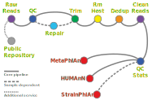

  

## Shotgun Metagenomics (Marker-Based) 
MetaPhlAn, HUMAnN, and StrainPhlAn form a complementary suite for shotgun metagenomic profiling. MetaPhlAn identifies and quantifies microbial taxa directly from sequencing reads using unique clade-specific marker genes. HUMAnN builds on those results to profile functional potential—linking reads to metabolic pathways and gene families. StrainPhlAn refines the taxonomic picture further by reconstructing strain-level variation within species, enabling comparison across samples or subjects. Together, these methods deliver species- to strain-level insights in two-to-three weeks, ready for downstream statistical analysis.

---

  

<strong>Sequencing Reads</strong>

<strong>Data QC</strong>

<strong>Analysis</strong>

<strong>Additional Service(s)</strong>

<strong>Maintenance</strong>

---
## Getting Started 

> 📩 Ready to process your dataset?  
> Specify your project size to receive a quotation.  
>  
> **Email:** [stephen.stockdale@biofigr.com](mailto:stephen.stockdale@biofigr.com)  
> **Website:** [https://www.biofigr.com/contact](https://www.biofigr.com/contact)

| Metric | Typical | Notes |
|--------|----------|-------|
| Turnaround Time | 2-3 weeks | Queue dependent |
| Sample Volume | 1 to >100 samples | Scalable |
| Admin Fee | € 600 | Project discussions and data transfer setup |
| Per Sample | € 80 | Pricing for marker-based shotgun metagenomics |
| NCBI SRA | € 400 | FASTQ FTP upload generating BioProject and SRA Accession IDs |
| BioFigR Figures | € POA | Per sample for marker-based shotgun metagenomics |
| Video Discussions | 3 sessions | Kick-off, Clade-selection (StrainPhlAn), and Wrap-up calls |
| Delivery | Dropbox / Filezilla | Data retained 30 days |

*Prices exclude VAT.

---
## Deliverables 

| Output File | Description | Format |
|--------------|-------------|---------|
| `merged_metaphlan4_profile.tsv` | Species-level relative abundances across samples | TSV |
| `humann_genefamilies.tsv` | Gene family abundance table | TSV |
| `humann_pathabundance.tsv` | Metabolic pathway abundance table | TSV |
| `humann_pathcoverage.tsv` | Pathway coverage table | TSV |
| `RAxML_bestTree.StrainPhlAn4.tre` | Phylogenetic tree of strain-level marker alignments | Newick |
| `StrainPhlAn4_concatenated.aln` | Multiple sequence alignment of marker genes | FASTA |
| `multiqc_report.html` | Aggregated QC summary | HTML |

- All files are delivered via secure download (Dropbox).  

> 💡 Note:  
> This service provides **data processing and QC reports**.  
> No biological or statistical interpretation is included in the standard deliverable.  
> Optional add-ons such as figure preparation, or data upload to public repositories, are available on request.

---
## Input Requirements 

| Requirement | Specification |
|--------------|----------------|
| Input format | Paired- or single-end FASTQ (gzipped) |
| Recommended read length | 50–150 bp |
| Minimum read depth | ≥ 3 million reads per sample |
| Accepted platforms | Illumina (NovaSeq, NextSeq, HiSeq) |
| Optional preprocessing | Repair (BBTools) or host removal (Kraken2) |

- Input files should be clearly named using sample identifiers (`sampleID_R1.fastq.gz`, `sampleID_R2.fastq.gz`).  
- Invalid or corrupt FASTQs will halt processing and trigger a report notification.  
- Inclusion or re-analysis of public data (i.e., NCBI SRA/ENA) is supported following evaluation.

> 💡 Note:  
> To generate an accurate quotation and allocate sufficient storage, please specify the **number of samples** and the **approximate size of each FASTQ file**.  
> This information is required to estimate total disk usage and compute resources prior to analysis.

---
## QC & Processing 

1. **Initial QC** – Read quality evaluated using *FastQC* and summarised with *MultiQC*.  
2. **Trimming** – Adapters and low-quality bases removed using *fastp*.  
3. **Optional Repair** – Read pairing validated with *BBTools repair* (if required).  
    - File integrity validation: *MD5 checksum*
    - Read count comparison between R1 and R2: *seqtk stats*
    - Sample identity checks: *mash sketch*
    - Multi-lane concatenation: *cat*
4. **Host Read Removal** – *Kraken2* used to remove contaminant or host reads when a host genome is supplied.  
5. **Deduplication** – *Clumpify* reduces optical duplicates to improve downstream mapping.  
6. **QC Reporting** – Comprehensive MultiQC summary provided.
7. **Profiling** –  
    - *MetaPhlAn4* for species-level taxonomic profiling  
    - *HUMAnN3* for gene- and pathway-level functional profiling  
    - *StrainPhlAn4* for within-species phylogenetic reconstruction (depth permitting)

---
## Data Handling & Reproducibility 

- **Dropbox** is used as it is OS-independent and user-friendly.
- Data sharing via Dropbox may involve temporary storage on servers located **outside the European Economic Area (EEA)**.
- **Secure File Transfer (SFTP)** is available as an alternative delivery method for clients who cannot use Dropbox.
-  Access is restricted to whitelisted IP addresses, and temporary credentials are issued per project.
-  Clients can connect using standard SFTP clients such as **FileZilla** or **WinSCP**.
- All FASTQ processing is executed within a locked **Conda environment** (`env.yml`) ensuring version control.
- Data are only processed in an Irish data centre with GDPR-compliant storage.

> 💡 Note:  
> FASTQ data is retained for a maximum **30-days post-delivery** after project completion and then purged from all active storage.

---
## Technical Details 

| Component | Tool / Version | Notes |
|------------|----------------|-------|
| QC | FastQC v0.12, MultiQC v1.15 | Read quality summaries |
| Reporting | MultiQC v1.15 | Combined QC report |
| Trimming | fastp v0.23 | Adapter and low-quality trimming |
| Host removal | Kraken2 | Optional; host genome or taxonomy database required |
| Deduplication | Clumpify v39 | Duplicate read removal |
| Taxonomic profiling | MetaPhlAn v4.x | Marker gene-based species profiling |
| Functional profiling | HUMAnN v3.x | Gene family and pathway quantification |
| Strain-level profiling | StrainPhlAn v4.x | Intra-species phylogenetic reconstruction |

- Virtual Machine (VM) or High-Performance Computing (HPC) resources are provided by: **CloudCIX** [https://www.cloudcix.com/](https://www.cloudcix.com/)
- Each analysis run uses 8–16 CPU threads and 60 GB RAM, with dedicated disk space allocated per sample and for all intermediate files.

---

  

***Bio***informatics | ***Fig***ures | ***R*** Stats
